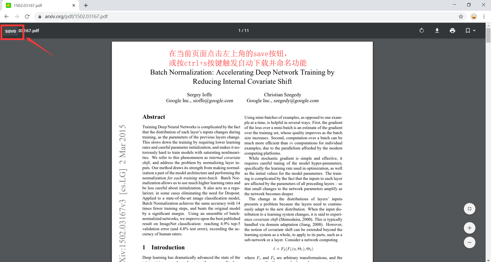

@[ROSE](文章目录)
- [前言](#前言)
- [一、翻墙工具](#一翻墙工具)
  - [蓝灯](#蓝灯)
  - [justmysocks2.net](#justmysocks2net)
  - [clash for windows](#clash-for-windows)
  - [Google Chrome Ghelper](#google-chrome-ghelper)
  - [V2Ray](#v2ray)
- [二、文献检索工具](#二文献检索工具)
  - [1.谷歌学术](#1谷歌学术)
  - [2. arxiv论文预印本网站](#2-arxiv论文预印本网站)
  - [3. SCI-HUB](#3-sci-hub)
  - [4. 中文文献](#4-中文文献)
  - [5. dblp](#5-dblp)
  - [6. IEEE Xplore](#6-ieee-xplore)
  - [7. elsevier](#7-elsevier)
  - [8. z-lib](#8-z-lib)
- [三. 文献管理工具](#三-文献管理工具)
  - [1. Mendeley](#1-mendeley)
  - [2. Zotero](#2-zotero)
  - [3. 坚果云](#3-坚果云)
  - [4.arxiv网站pdf自动改名工具](#4arxiv网站pdf自动改名工具)
- [四. 论文写作工具](#四-论文写作工具)
  - [1. 在线 latex 写作网站（国内版）](#1-在线-latex-写作网站国内版)
  - [2. 在线 latex 写作网站：overleaf（美国版）](#2-在线-latex-写作网站overleaf美国版)
  - [3. 在线 latex 公式编辑器](#3-在线-latex-公式编辑器)
  - [4. 在线函数图像绘制工具](#4-在线函数图像绘制工具)
  - [5. 在线英文语法检查工具 Grammarly](#5-在线英文语法检查工具-grammarly)
  - [6. 写作搭配](#6-写作搭配)
  - [7. 曼彻斯特大学-英语论文词句模板库](#7-曼彻斯特大学-英语论文词句模板库)
  - [8. drawio流程图绘制网站](#8-drawio流程图绘制网站)
  - [9. PPT画矢量图绘制途径](#9-ppt画矢量图绘制途径)
  - [10. 压缩PDF文件体积的方法](#10-压缩pdf文件体积的方法)
- [四. 大文件传输工具](#四-大文件传输工具)
  - [1. 文叔叔](#1-文叔叔)
  - [2. 奶牛快传](#2-奶牛快传)
  - [3.百度网盘下载工具PCS](#3百度网盘下载工具pcs)
- [五. 远程及日常办公软件](#五-远程及日常办公软件)
  - [1. Teamviewer](#1-teamviewer)
  - [2. Office](#2-office)
  - [3. 在线视频下载器](#3-在线视频下载器)
  - [4. CSDN网站去广告](#4-csdn网站去广告)
  - [5. ToDesk](#5-todesk)
- [总结](#总结)

# 前言

工欲善其事必先利其器，这篇博客教你使用科研过程中常见软件工具，提高科研效率。

# 一、翻墙工具
翻墙软件千千万，但墙也不断地在升级。经常会出现以前能用的方法现在失效了，所以遇到翻不过的时候不要着急，换条路子没准就管用。

## 蓝灯

[https://github.com/getlantern/lantern](https://github.com/getlantern/lantern)

如果你是windows系统，直接点击[这里Windows7及以上 Windows 7+](https://gitlab.com/getlantern/lantern-binaries-mirror/-/raw/master/lantern-installer.exe)就可以下载。无需注册，直接使用。（2021.02 蓝灯无法访问谷歌学术）
如果想断开蓝灯，在任务栏蓝灯图标上右键单击断开。访问国内网站的时候可断开。

## justmysocks2.net

购买just my socks服务（5.88美金/月）如果网站跳转失败注意检查域名是否为justmysocks2.net

[https://justmysocks2.net/members/cart.php](https://justmysocks2.net/members/cart.php)

使用shadowsocks软件

[https://github.com/shadowsocks/shadowsocks-windows](https://github.com/shadowsocks/shadowsocks-windows)

安装好之后->shadwsocks小飞机图标->右键->服务器->扫描屏幕上的二维码
就可以将购买的服务器地址导入 
2021.02 可以访问谷歌学术

## clash for windows

[软件下载](https://github.com/Fndroid/clash_for_windows_pkg/releases)

平台有很多，例如：

[机场](https://j01.space/waf/10242)

**[https://ikuuu.co/auth/login#](https://ikuuu.co/auth/login#)**

[教学贴](https://t66y.com/htm_data/2102/7/4345018.html)

## Google Chrome Ghelper
可以在chrome 浏览器应用市场里直接搜索Ghelper，有免费流量，但是不太推荐用，有时候会挂，和V2Ray有冲突很难卸载。

## V2Ray 

这个较为高阶，V2Ray 是一个与 Shadowsocks 类似的代理软件，功能更强大，配置复杂，抗干扰能力强，突破防火墙封锁能力强。

[https://iyideng.me/black-technology/cgfw/v2ray-vmess-vless.html](https://iyideng.me/black-technology/cgfw/v2ray-vmess-vless.html)

# 二、文献检索工具
## 1.谷歌学术
[https://scholar.google.com/](https://scholar.google.com/)

附一条：
添加latex参考文献的方法，搜索paper题目，点击cite按钮，选择bibtex，将全部信息复制后，粘贴到在线latex网站的bib文件里。
使用方法：引用的时候在正文里打上 \cite{文章缩写代号}

## 2. arxiv论文预印本网站
这个网站主要是论文作者们挂自己即将要投稿的paper，基本上理工科最新的科研进展，第一手paper草稿在这上都可以找到。

[https://arxiv.org/](https://arxiv.org/)

高阶的arxiv搜索网站,搜索结果更准确，网站可视化效果比传统arxiv要高一个档次。由[Andrej Karpathy大佬](https://github.com/lvmingzhe/latex/blob/main/experience.md#andrej-karpathy-stanford-phd-%E6%9D%8E%E9%A3%9E%E9%A3%9E%E9%AB%98%E5%BE%92%E8%91%97%E5%90%8D%E7%9A%84cs231n%E8%AF%BE%E7%A8%8B%E4%B8%BB%E8%AE%B2%E7%89%B9%E6%96%AF%E6%8B%89ai%E9%AB%98%E7%BA%A7%E6%80%BB%E7%9B%91)利用业余时间开发的。

[http://www.arxiv-sanity.com/](http://www.arxiv-sanity.com/)

## 3. SCI-HUB
当你不在高校内网时，下载一篇paper通常非常费劲，需要面对各种版权的问题。但是这个网站专门破解了版权，让世界各地的人自由下载paper，因此也经常被各种出版商告到法院。

[https://sci-hub.se/](https://sci-hub.se/)

## 4. 中文文献
如果你不在高校内网，但又需要下载中文参考文献，比如中国知网或者万方数据库。那么这两家网站可以一试，还算稳定，收费每月10块。

中文文献下载5730图书馆：
[http://www.5730.cn/](http://www.5730.cn/)

论文驿站
[https://www.lunwenyizhan.com/](https://www.lunwenyizhan.com/)

## 5. dblp

DBLP（DataBase systems and Logic Programming）是计算机领域内对研究的成果以作者为核心的一个计算机类英文文献的集成数据库系统。

[https://dblp.uni-trier.de/](https://dblp.uni-trier.de/)

## 6. IEEE Xplore

IEEE 文章官方检索

[https://ieeexplore.ieee.org/Xplore/home.jsp](https://ieeexplore.ieee.org/Xplore/home.jsp)

高校内网直接点击下载，不在高校时复制该文章的DOI码（例如 10.1109/IoT-SIU.2019.8777334 ），转到

[https://sci-hub.se/](https://sci-hub.se/)

将DOI码粘贴到搜索栏后点击open下载

## 7. elsevier

爱思唯尔官网，操作同上一条。

[https://www.elsevier.com/](https://www.elsevier.com/)

## 8. z-lib

电子书及论文下载网站

[https://1lib.net/](https://1lib.net/)

# 三. 文献管理工具
## 1. Mendeley
免费开源的文献管理工具，支持全文pdf搜索，在线同步所有文档，空间2GB
[https://www.mendeley.com/](https://www.mendeley.com/?interaction_required=true)

## 2. Zotero
免费开源的文献管理工具
Zotero is a free, easy-to-use tool to help you collect, organize, cite, and share research.
[https://www.zotero.org/](https://www.zotero.org/)

## 3. 坚果云
不同于百度网盘适合大文件低频率更新方式的存储，坚果云擅长文档类文件实时更新式云端存储

可以永久解决积累海量文献以后，mendeley和zotero在线空间受限不够用的问题

很适合作为pdf文献管理的网盘。
[jianguoyun.com](https://www.jianguoyun.com/s/campaign/cpclanding/main?sch=bdcpc_ppzq)

## 4.arxiv网站pdf自动改名工具
功能：下载pdf论文并自动用文章标题重命名文件，点击左上角的save按钮或按 Ctrl+S 触发下载.
Currently support pdf pages in arxiv.org, aclweb.org/anthology/, proceedings.mlr.press，openaccess.thecvf.com, openreview.net, and ieeexplore.ieee.org.

1. 安装油猴脚本管理器
[https://greasyfork.org/zh-CN](https://greasyfork.org/zh-CN)

2. 安装arxiv改名脚本
[https://greasyfork.org/en/scripts/370419-paperdownload-titleaspdfname](https://greasyfork.org/en/scripts/370419-paperdownload-titleaspdfname)

3. 上arxiv网站使用save功能就可以自动改名保存

# 四. 论文写作工具
latex是一种学术论文写作工具，其优点是将内容脱离模板，使写作者可以专注到文章内容的创作中，简化公式编辑，参考文献添加删除的操作，比word写作效率要高很多。
缺点是需要一点编程基础，新手上手需要一段时间的适应。
## 1. 在线 latex 写作网站（国内版）
- 【raisepub】服务器在北京，访问速度快且稳定。缺点是由于缺少review功能，导致多人协同写作功能弱。如果是一个人写作，且在家上网的话，强烈推荐。

[http://raisepub.com/](http://raisepub.com/)

- 【Texpage】服务器在浙江，缺少review功能

[https://www.texpage.com/](https://www.texpage.com/)

## 2. 在线 latex 写作网站：overleaf（美国版）
该网站服务器在美国，访问速度慢不稳定，但是北京市科技网访问还是很稳定的。优点是具有review功能，多人协同写作功能强。团队写作推荐。

[https://www.overleaf.com/](https://www.overleaf.com/)

## 3. 在线 latex 公式编辑器
我最喜欢的在线手写 latex 公式编辑器。它的优点是直接使用鼠标手画公式，实时生成latex代码甚至函数图像！

[https://webdemo.myscript.com/views/math/index.html#](https://webdemo.myscript.com/views/math/index.html#)

另一个很专业的LaTeX公式编辑器，图片识别强大，扣别人的公式很方便:

[https://www.latexlive.com/##](https://www.latexlive.com/##)

第三个LaTeX公式编辑器，著名的Mathpix Snip.截图功能强大，但需要本地安装。

[https://mathpix.com/](https://mathpix.com/)

## 4. 在线函数图像绘制工具
可以帮助你快速地绘制出函数图像，免去打开matlab画曲线的烦恼

[https://zh.numberempire.com/graphingcalculator.php](https://zh.numberempire.com/graphingcalculator.php?functions=log%28x%29,sqrt%28x%29,sin%28x%29,1/x,x%5E2&xmin=-1.256219&xmax=4.603156&ymin=-0.826319&ymax=3.079935&var=x)

## 5. 在线英文语法检查工具 Grammarly

免费的英文语法检查工具，对常见的冠词错误，单复数错误，单词拼写错误，标点符号错误，时态错误等均可检查。有两种使用方法，小段的英文可以用百度翻译+grammarly插件进行检查。大段的英文可以直接复制到grammarly官网进行全文检查。

[https://www.grammarly.com/](https://www.grammarly.com/)

## 6. 写作搭配

查询英语词组常用搭配的网站(thanks 王乐源)

[https://linggle.com/]( https://linggle.com/)

## 7. 曼彻斯特大学-英语论文词句模板库

收录了丰富的学术写作短语、句型，并且罗列了超多例句，可以很好规范英文论文表达！

对于论文的每一部分都有细致的范例，比如：前言、参考文献、研究方法、结果阐述、研讨、写作结论等。

[http://www.phrasebank.manchester.ac.uk/](http://www.phrasebank.manchester.ac.uk/)

## 8. drawio流程图绘制网站

diagrams可以绘制一些简单的流程图，思维导图，矢量图。图片可存在GitHub上。

[https://www.diagrams.net/](https://www.diagrams.net/)

画一般论文插图的话,PPT都够用，画矢量图VISIO更专业一些。

> VScode上有一款drawio的插件，在本地绘制也很方便。作者 Henning Dieterichs。

## 9. PPT画矢量图绘制途径

先使用PPT绘制流程图，另存为PDF。然后上[pdfresizer](https://pdfresizer.com/crop)网站自动裁剪PDF。

[https://pdfresizer.com/crop](https://pdfresizer.com/crop)

该网站也支持手动裁剪。下载裁剪好的pdf,导入在线latex编译即可。

如果需要eps格式的矢量图，可以用Adobe Acrobat软件进行pdf->eps转换。

pdf裁剪也可以通过Acrobat软件进行。

## 10. 压缩PDF文件体积的方法

使用 Adobe Acrobat Pro DC，文件->另存为其他—>优化的PDF->(图像缩减采样关闭)->确定

Acrobat 下载链接：[https://pan.baidu.com/s/15T2CeIIW3PFR_4OpMgDXgg](https://pan.baidu.com/s/15T2CeIIW3PFR_4OpMgDXgg) 提取码：akll 

# 四. 大文件传输工具

在科研过程中，我们经常需要传输数据集或者大文件，使用U盘或移动硬盘拷贝比较麻烦。百度网盘的龟速又难以忍受，这个时候就需要快速传输大文件的网站了。

## 1. 文叔叔
无需注册，传文件只需要两步：上传，发送。

[https://www.wenshushu.cn/](https://www.wenshushu.cn/)

## 2. 奶牛快传

与前者类似，操作非常简单。

[https://cowtransfer.com/](https://cowtransfer.com/)

## 3.百度网盘下载工具PCS

有时候其他人用百度网盘发来的链接，用BaiduPCS-Go下载的话速度还是会快很多。我在linux服务器上命令行模式用过，配置不算太麻烦。

[https://github.com/felixonmars/BaiduPCS-Go](https://github.com/felixonmars/BaiduPCS-Go)

如果充百度超级会员的话，建议在每年的11月份百度网盘周年庆的时候，价格大概也就170元/年。我用超级会员下载速度大概在10MB/S。

# 五. 远程及日常办公软件

## 1. Teamviewer

以前也用过向日葵，anydesk，最后还是都不如teamviewer.

[https://www.teamviewer.com/en/download/windows/](https://www.teamviewer.com/en/download/windows/)

唯一的问题就是容易被判定为商用，一般改一下MAC地址就好了。下边是改MAC的教程。

>1. 关闭TeamViewer。
>2. 开始 > 运行，输入 %appdata%，删除TeamViewer的文件夹。
>3. 开始 > 运行，输入 regedit；删除 HKEY_LOCAL_MACHINE\SOFTWARE\ 之下的 TeamViewer；删除 HKEY_CURRENT_USER\SOFTWARE\ 之下的 TeamViewer；
>4. 开始 > 运行，输入 cmd，输入 ipconfig /all ，查看本地网卡的MAC地址
>5. 控制面板 > 网络和Internet> 网络和共享中心 > 更改适配器设置 > 本地连接/无线网卡;单击右键 > 属性 > Microsoft 网络客户端 > 配置 > 高级；在数值栏输入一个和上文相近的MAC地址或随意12位数字字符串，点确定保存。
>6. 重启电脑，你会发现你的 TeamViewer ID 已改变。成功！

## 2. Office

- WORD
- PPT
- EXCEL
- VISIO

常用三件套 + 矢量化作图工具VISIO 正版激活只需要十几二十元统统可以在淘宝买到，链接就不放了。

[OFFICE TOOLS PLUS](https://t66y.com/htm_data/2103/7/4370004.html)

## 3. 在线视频下载器

下载youtube的视频很方便

[https://en.savefrom.net/18/](https://en.savefrom.net/18/)

## 4. CSDN网站去广告

1. 安装油猴脚本管理器
[https://greasyfork.org/zh-CN](https://greasyfork.org/zh-CN)
2. 安装[CSDN去广告](https://openuserjs.org/scripts/AdlerED/%E6%9C%80%E5%BC%BA%E7%9A%84%E8%80%81%E7%89%8C%E8%84%9A%E6%9C%ACCSDNGreener%EF%BC%9ACSDN%E5%B9%BF%E5%91%8A%E5%AE%8C%E5%85%A8%E8%BF%87%E6%BB%A4%E3%80%81%E4%BA%BA%E6%80%A7%E5%8C%96%E8%84%9A%E6%9C%AC%E4%BC%98%E5%8C%96)
3. 打开CSDN，广告消失。

## 5. ToDesk

一款简单易用的多平台远程控制国产软件，稳定性好，且访问速度比TeamViewer快。

[https://www.todesk.com/](https://www.todesk.com/)

# 总结
使用对的工具做事情能提高效率，事半功倍。希望本篇博文能对你的科研工作有帮助。
